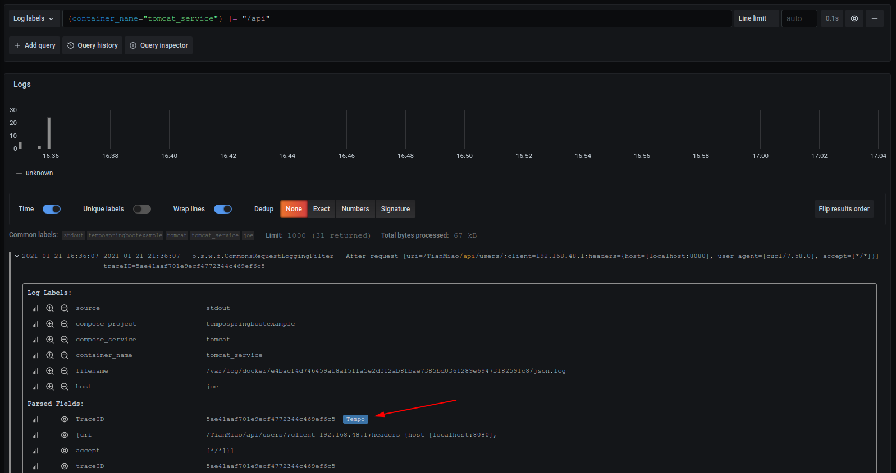
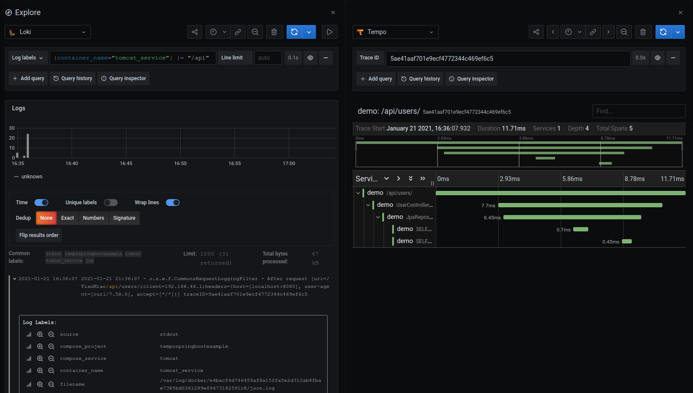

# Springboot, OTEL and Tempo

This repo is forked from https://github.com/HechengLi/Docker_SpringBoot_Tomcat_MySQL_Demo.  Thanks to [HechengLi](https://github.com/HechengLi) for the inital work of setting up the Tomcat/Springboot/Java demo that this is built on top of.

## How to run this demo?

### Step 0 - Requirements
You will need:
1. Docker
1. Maven
1. Java10

### Step 1 - Clone this repo
`git clone https://github.com/joe-elliott/tempo-springboot-example`

### Step 2 - Build TianMiao as a war file
1. cd TianMiao
1. mvn clean install -Dmaven.test.skip=true

### Step 3 - Install Loki logging driver
`docker plugin install grafana/loki-docker-driver:latest --alias loki --grant-all-permissions`

### Step 4 - Run the project with docker
1. Open your commandline, cd to the git directory
1. Run 'docker-compose -f stack.yml up' (add -d if you want it to run in background)

### Step 5 - Rerun if there's an error on first run :(
1. If you get an error while starting tomcat, it probably is because the docker container running Tomcat doesn't wait for MySQL to finish running it's setup script.
1. Wait for MySQL to finish running its script (it will log ...ready for connections...)
1. Stop all containers and start again should fix the problem.

### Step 6 - Exercise the API
> `curl http://localhost:8080/TianMiao/api/users`

> `curl -X POST -H 'Content-Type: application/json' -d '{"username": "test"}'  http://localhost:8080/TianMiao/api/users`

> `curl http://localhost:8080/TianMiao/api/users/1`

### Step 7 - Find some traces!

1. Open http://localhost:3000/explore and make sure that Loki is selected.
1. Search for `{container_name="tomcat_service"} |= "/api"`
1. Expand a log line and click the Tempo button to see the trace!

This should retrieve the trace from Tempo and display it like so:

